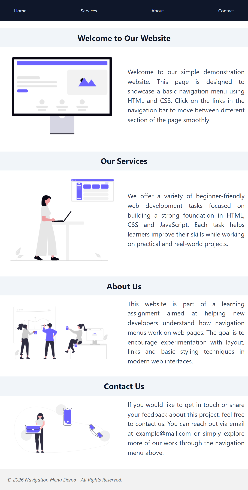
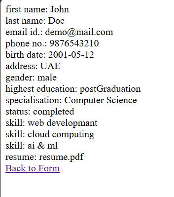

# web-development-internship-tasks
This repository contains a collection of tasks completed during my Web Development Internship.  
These tasks demonstrate practical skills in HTML, CSS, and JavaScript. They include responsive layouts, UI components, forms, navigation menus and interactive web applications. This is ideal for showcasing fundamental front-end development capabilities.

---

## 📌 Task 2 — E-commerce Product Page

### 📖 Description
Developed a responsive and visually appealing **E-commerce Product Page** showcasing multiple product categories such as **Electronics**, **Fashion & Lifestyle** and **Home & Living**.

The page focuses on a clean UI, intuitive layout, and responsiveness across different screen sizes using **CSS Grid, Flexbox and Media Queries**. It simulates a real-world online shopping experience with product cards, pricing, category navigation, and call-to-action buttons.

### 🎯 Skills & Concepts
- HTML5 semantic structure  
- CSS Grid & Flexbox  
- Responsive design using media queries  
- UI/UX design principles  
- Category-based product layout  
- Smooth scrolling navigation  
- Button hover interactions  

### 🗂️ Project Structure
```
web-development-internship-tasks/
│
├── task2-e-commerce-product-page/
│   ├── index.html
│   ├── css/
│   │    └── style.css
│   └── assets/
│        ├── img/               → Section display images
│        └── screenshot/       → Page preview screenshot
│
├── README.md
├── LICENSE                → (MIT)
└── .gitignore             → (Node)
```

### 🖼️ Preview
- E-commerce Product Page  


---

## 📌 Task 3 — Navigation Menu Webpage

### 📖 Description
Developed a simple responsive navigation page with internal section links for smooth user scrolling. The page includes sections like Home, About, Services, Contact, and Footer along with basic UI styling for usability.

### 🎯 Skills & Concepts
- HTML semantic sections
- Navigation bar
- Internal anchor links
- Smooth scrolling using JavaScript
- Basic CSS styling and layout

### 🗂️ Project Structure
```
web-development-internship-tasks/
│
├── task3-navigation-menu/
│   ├── index.html
│   ├── css/
│   │    └── style.css
│   └── assets/
│        ├── img/               → Section display images
│        └── screenshots/       → Page preview screenshot
│
├── README.md
├── LICENSE                → (MIT)
└── .gitignore             → (Node)
```

### 🖼️ Preview

- Navigated Web Page


---

## 📌 Task 4 — HTML Contact Form

### 📖 Description
Developed a basic contact form to practice HTML form components such as:
- Text inputs
- Email & phone fields
- Radio buttons
- Checkboxes
- Date input
- File upload
- Textarea

The form also includes required fields, basic client-side validation, and displays submitted data on a separate results page using URL query parsing.

### 🎯 Skills & Concepts
- HTML
- Form elements & attributes
- Form validation
- GET method
- Basic input handling

### 🗂️ Project Structure
```
web-development-internship-tasks/
│
├── task4-contact-form/
│   ├── index.html
│   ├── results.html
│   └── assets/
│        └── screenshots/       → Page preview screenshot
│
├── README.md
├── LICENSE                → (MIT)
└── .gitignore             → (Node)
```

### ▶️ How to Run
1. Open `task4-contact-form/index.html` in a browser.
2. Fill the form and submit.
3. Form results will be displayed on `results.html`.

### 🖼️ Preview

- Contact Form (Empty)


- Submission Result


---

### 👨‍💻 Author
**Lokesh Sapkal**  
Web Development Intern

---
