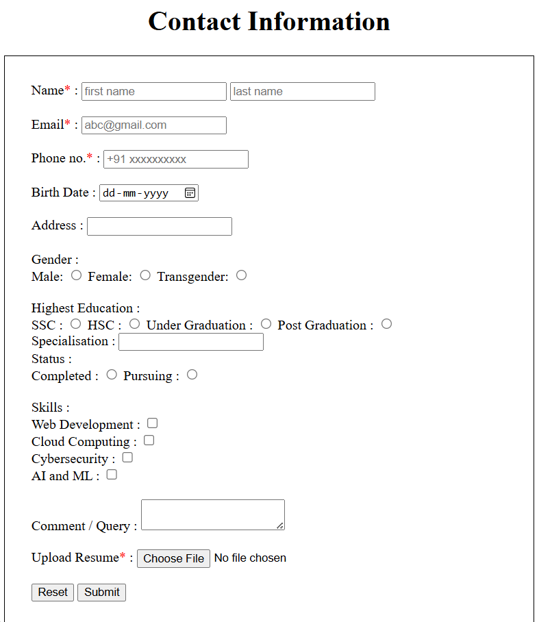

# web-development-internship-tasks
This repository contains a collection of tasks completed during my Web Development Internship.  
These tasks demonstrate practical skills in HTML, CSS, and JavaScript. They include responsive layouts, UI components, forms, navigation menus and interactive web applications. This is ideal for showcasing fundamental front-end development capabilities.

---

## 📌 Task 4 — HTML Contact Form

### 📖 Description
Developed a basic contact form to practice HTML form components such as:
- Text inputs
- Email & phone fields
- Radio buttons
- Checkboxes
- Date input
- File upload
- Textarea

The form also includes required fields, basic client-side validation, and displays submitted data on a separate results page using URL query parsing.

---

### 🎯 Skills & Concepts
- HTML
- Form elements & attributes
- Form validation
- GET method
- Basic input handling

---

### 🗂️ Project Structure
```
web-development-internship-tasks/
│
├── task4-contact-form/
│   ├── index.html
│   ├── results.html
│   └── screenshots/
│    ├── form-empty.png
│    └── results.png
│
├── README.md
├── LICENSE                → (MIT)
└── .gitignore             → (Node)
```
---

### ▶️ How to Run
1. Open `task4-contact-form/index.html` in a browser.
2. Fill the form and submit.
3. Form results will be displayed on `results.html`.

---

### Preview

- Contact Form (Empty)


- Submission Result


---

### 👨‍💻 Author
**Lokesh Sapkal**  
Web Development Intern

---
